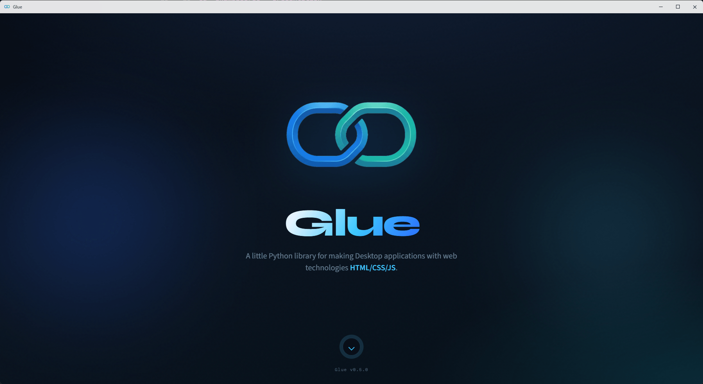
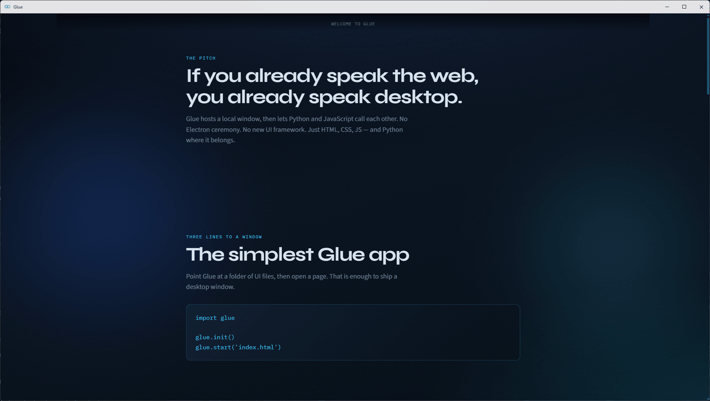
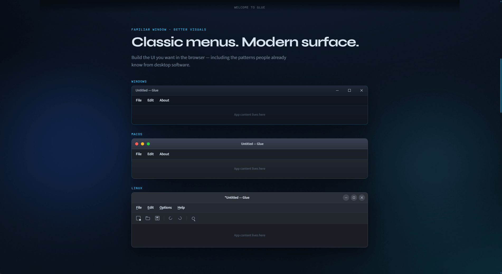
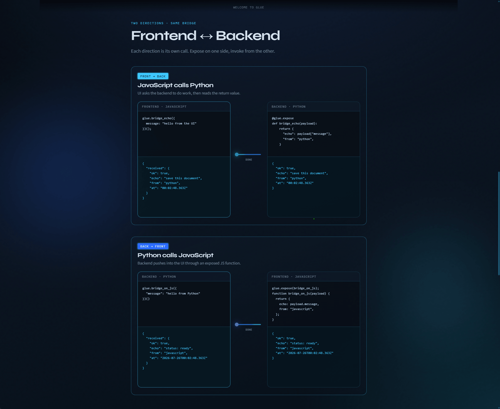
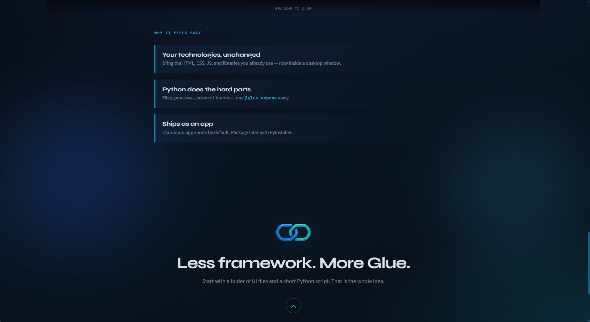

# Glue
<sub>Glue is a fork of [Eel](https://github.com/python-eel/Eel) by Chris Knott and contributors.</sub>



A little Python library for making **desktop apps with HTML, CSS, and JavaScript** — plus full access to Python. It hosts a local window, then lets Python and JavaScript call each other. No Electron ceremony. No new UI framework.

---

### If you already speak the web, you already speak desktop. The simplest Glue app is three lines of Python.



### Classic desktop app you can build yourself — Windows, macOS, and Linux styles.



### JavaScript calls Python, and Python calls JavaScript — same bridge, both directions.



### Your technologies stay the same. Python does the hard parts. Ships as an app. Start with a folder of UI files and a short Python script. That is the whole idea.



---

## Install

Glue is not on PyPI yet — install from this repo or GitHub.

From a clone of this repo:

```shell
pip install .
```

Editable / development (code changes apply without reinstalling):

```shell
pip install -e .
```

Directly from GitHub (no local clone required):

```shell
pip install "git+https://github.com/alepodj/Glue.git@main"
```

Optional extras (`.` = the package in the current directory):

```shell
pip install ".[jinja2]"   # Jinja2 templates
pip install ".[build]"    # PyInstaller for packaging
```

---

## Quick start

Put your frontend in a folder named `ui/` (the default), then:

```python
import glue

glue.init()
glue.start('index.html')
```

Override the folder with `glue.init('web')` (or any path). By default Glue opens a **PyWebView** native window. If that isn’t available, it falls back to **Chrome/Chromium** in app mode (`--app`), then **Edge** on Windows only.

Include the bridge on every page:

```html
<script type="text/javascript" src="/glue.js"></script>
```

---

## Demo

The [`examples/00 - presentation`](examples/00%20-%20presentation) app is a full walkthrough of the idea. Run it with:

```shell
cd "examples/00 - presentation"
python presentation.py
```

---

## Call both ways

### Python → available in JavaScript

```python
@glue.expose
def add(a, b):
    return a + b
```

```javascript
let sum = await glue.add(1, 2)();
```

### JavaScript → available in Python

```javascript
glue.expose(js_random);
function js_random() {
  return Math.random();
}
```

```python
n = glue.js_random()()          # wait for the value
glue.js_random()(print)         # or use a callback
```

Complex values travel as JSON over a WebSocket.

If a JS bundler renames functions, expose them with an explicit name:

```javascript
glue.expose(someFunction, "my_javascript_function");
```

---

## Hello, World!

Full example: [`examples/01 - hello_world`](examples/01%20-%20hello_world)

**`ui/hello.html`**

```html
<!DOCTYPE html>
<html>
  <head>
    <title>Hello, World!</title>
    <script type="text/javascript" src="/glue.js"></script>
    <script type="text/javascript">
      glue.expose(say_hello_js);
      function say_hello_js(x) {
        console.log("Hello from " + x);
      }

      say_hello_js("Javascript World!");
      glue.say_hello_py("Javascript World!");
    </script>
  </head>
  <body>Hello, World!</body>
</html>
```

**`hello.py`**

```python
import glue

glue.init()

@glue.expose
def say_hello_py(x):
    print('Hello from %s' % x)

say_hello_py('Python World!')
glue.say_hello_js('Python World!')

glue.start('hello.html')
```

Run `python hello.py`. Calls made before the window opens are queued until the WebSocket is ready.

---

## Return values

Python and the UI talk over a WebSocket. Glue gives you two ways to get a result back.

**Callback**

```python
glue.js_random()(lambda n: print('Got', n))
```

**Synchronous wait** (after `glue.start()`, or with `block=False`)

```python
n = glue.js_random()()
```

In JavaScript, use `async` / `await`:

```javascript
let n = await glue.py_random()();
```

Python waits up to 10 seconds for a JS result by default (`js_result_timeout` on `glue.init`).

---

## App options

Pass keyword arguments to `glue.start()`:

| Option | Default | Notes |
|--------|---------|--------|
| `mode` | `'auto'` | `'auto'`, `'webview'` / `'pywebview'`, `'chrome'`, `'edge'`, `'custom'`, or `None`/`False` (no window) |
| `host` | `'localhost'` | Bottle bind host |
| `port` | `8000` | Use `0` to pick automatically |
| `block` | `True` | Set `False` to keep running your own loop (skips PyWebView in `auto`) |
| `size` | `None` | `(width, height)` content pixels |
| `position` | `None` | `(left, top)` in pixels |
| `title` | `None` | Native window title for PyWebView (defaults to `'Glue'`) |
| `resizable` | `True` | Allow the user to resize the PyWebView window |
| `app_mode` | `True` | Chromium `--app` desktop-like window (ignored for PyWebView) |
| `cmdline_args` | `['--disable-http-cache']` | Extra browser flags |
| `jinja_templates` | `None` | Folder name for Jinja2 templates |
| `geometry` | `{}` | Per-page size/position |
| `close_callback` | `None` | Called when a window closes |
| `all_interfaces` | `False` | Bind on `0.0.0.0` (any client can call `@glue.expose` — trusted networks only) |
| `disable_cache` | `True` | Send `no-store` when serving assets |
| `default_path` | `'index.html'` | File served for the root URL `/` |
| `app` | new Bottle | Pass your own Bottle app / middleware |
| `shutdown_delay` | `1.0` | Seconds to wait before exit when the last window closes |
| `webview_options` | `{}` | Extra PyWebView kwargs — see table below |

### PyWebView options

`webview_options` is passed through to PyWebView (`create_window` / `webview.start`). Glue also sets a few first-class `start()` knobs and opinionated defaults:

| Option | Default | Notes |
|--------|---------|--------|
| `title` | `'Glue'` | First-class on `glue.start()` — window / title-bar label |
| `resizable` | `True` | First-class on `glue.start()` — on Windows frameless, Glue adds edge grips |
| `size` / `position` / `geometry` | `None` / `{}` | First-class on `glue.start()` — content pixels; Glue grows height by the in-page title bar |
| `frameless` | `True` | Via `webview_options` — no native caption bar; Glue injects an OS-styled title bar |
| `easy_drag` | `False` | Via `webview_options` — drag via the title-bar region only |
| `shadow` | `True` on Windows | Via `webview_options` — window shadow |
| `menu` | `[]` | Via `webview_options` — no native File/Edit menu unless you pass one |
| `icon` | `ui/favicon.ico` if present | Via `webview_options` / auto — taskbar/dock; title bar uses `/favicon.ico` or `<link rel="icon">` |
| `debug` | `False` | Via `webview_options` — `True` restores browser accelerators (F5, F12, …) and the default context menu |
| `gui` | auto | Via `webview_options` — force backend: e.g. `'edgechromium'`, `'qt'`, `'gtk'` |
| `confirm_close` | `False` | Via `webview_options` — native “close?” dialog |
| `fullscreen` / `minimized` / `maximized` / `on_top` | `False` | Via `webview_options` — window state flags |
| `min_size` | PyWebView default | Via `webview_options` — `(width, height)` minimum |
| `text_select` / `zoomable` / `private_mode` / … | PyWebView defaults | Via `webview_options` — see [PyWebView API](https://pywebview.flowrl.com/guide/api.html) |

Also: Glue sets `SHOW_DEFAULT_MENUS=False` so stock Edit menus stay off unless you build your own. Advanced window control: `glue.get_webview_windows()`.

Examples:

```python
glue.start(
    'main.html',
    mode='webview',
    title='My App',
    size=(1280, 720),
    resizable=True,
    webview_options={'confirm_close': True},
)
```

```python
# Stock native OS chrome (no Glue title bar)
glue.start('index.html', webview_options={'frameless': False})

# Native menu + your actions
from webview.menu import Menu, MenuAction
glue.start('index.html', webview_options={
    'frameless': False,
    'menu': [Menu('File', [MenuAction('Quit', lambda: None)])],
})

# DevTools / browser shortcuts
glue.start('index.html', webview_options={'debug': True})
```

---

## Hosts

Not Windows-only — this is **how Glue opens your UI** on any OS.

Default order for `mode='auto'`:

1. **PyWebView** — native window (Windows / macOS / Linux); full control via PyWebView APIs / `glue.get_webview_windows()`
2. **Chrome/Chromium** — app mode (`--app`) on all platforms
3. **Edge** — Windows only, if Chrome is missing

PyWebView defaults are under [PyWebView options](#pywebview-options) (frameless title bar, menus, resize grips, `debug`, etc.).

| `mode` | Behavior |
|--------|----------|
| `'auto'` | PyWebView → Chrome → Edge (Windows); see above |
| `'webview'` / `'pywebview'` | Force PyWebView (no browser fallback) |
| `'chrome'` / `'edge'` | Force that Chromium browser |
| `None` / `False` | Server only (tests, custom frontends) |
| `'custom'` | Your own command via `cmdline_args` |

Try [`01 - hello_world`](examples/01%20-%20hello_world) for auto launch, or [`02 - hello_world_chrome`](examples/02%20-%20hello_world_chrome) to force Chrome.

---

## Async Python

Glue uses Bottle + Gevent. Prefer `glue.sleep()` and `glue.spawn()` over `time.sleep()`.

If you need Gevent monkey-patching, do it **before** importing Glue:

```python
from gevent import monkey
monkey.patch_all()
import glue
```

```python
import glue
glue.init()

def ticker():
    while True:
        print("tick")
        glue.sleep(1.0)

glue.spawn(ticker)
glue.start('main.html', block=False)

while True:
    print("main")
    glue.sleep(1.0)
```

With `block=False`, `mode='auto'` skips PyWebView (its GUI loop needs the main thread) and uses Chrome/Edge instead.

---

## Package with PyInstaller

1. Use a clean virtualenv with only what you need
2. `pip install ".[build]"`
3. From your app folder: `python -m glue your_script.py ui`
4. Check `dist/`, then ship with `--onefile --noconsole` when ready

Extra PyInstaller flags pass through, for example:

```shell
python -m glue file_access.py ui --exclude numpy --onefile --noconsole
```

See the [PyInstaller docs](https://pyinstaller.readthedocs.io/) for more.

---

## Examples

| Example | What it shows |
|---------|----------------|
| [`00 - presentation`](examples/00%20-%20presentation) | Full product story (screenshots above) |
| [`01 - hello_world`](examples/01%20-%20hello_world) | Minimal two-way hello |
| [`02 - hello_world_chrome`](examples/02%20-%20hello_world_chrome) | Force Chrome |
| [`03 - callbacks`](examples/03%20-%20callbacks) | Async callbacks |
| [`04 - sync_callbacks`](examples/04%20-%20sync_callbacks) | Blocking returns |
| [`05 - file_access`](examples/05%20-%20file_access) | Python file access from the UI |
| [`06 - input`](examples/06%20-%20input) | Live input bridge |
| [`07 - jinja_templates`](examples/07%20-%20jinja_templates) | Jinja2 pages |
| [`08 - createreactapp`](examples/08%20-%20createreactapp) | React + TypeScript |
| [`09 - disable_cache`](examples/09%20-%20disable_cache) | Cache control |
| [`10 - custom_app_routes`](examples/10%20-%20custom_app_routes) | Custom Bottle routes |

---

## Project layout for an app

```
my_app.py
ui/
  index.html
  css/
  js/
```

Frontend lives under one `ui/` root (by default). Backend is normal Python. Glue glues them together.
